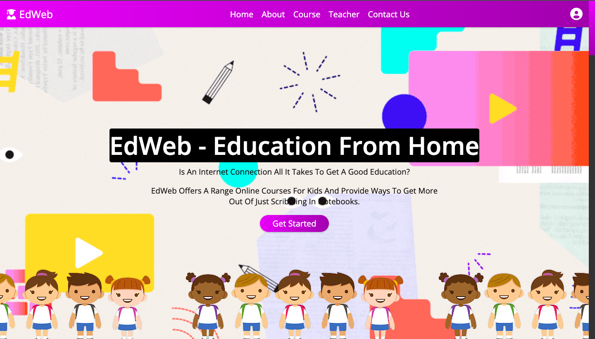
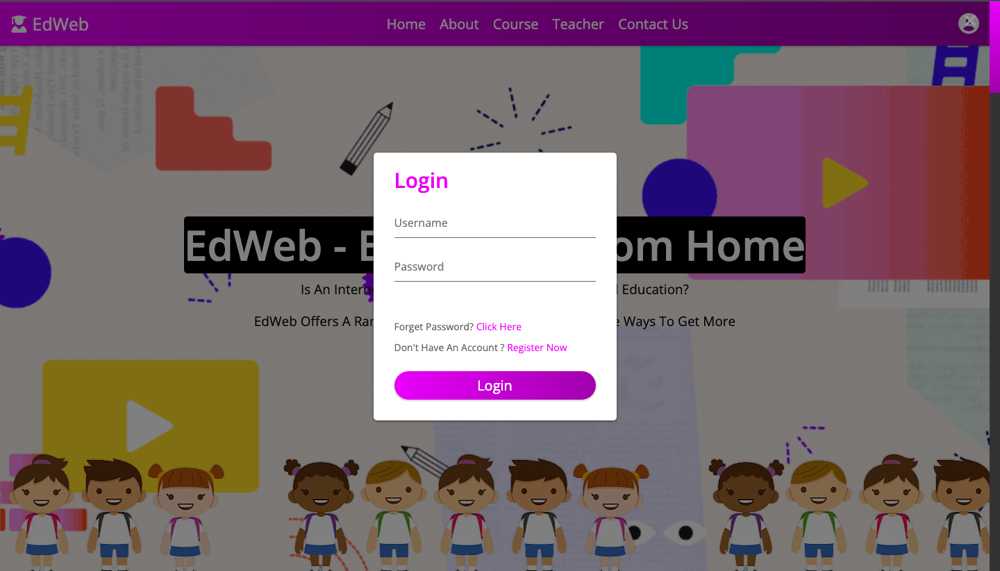
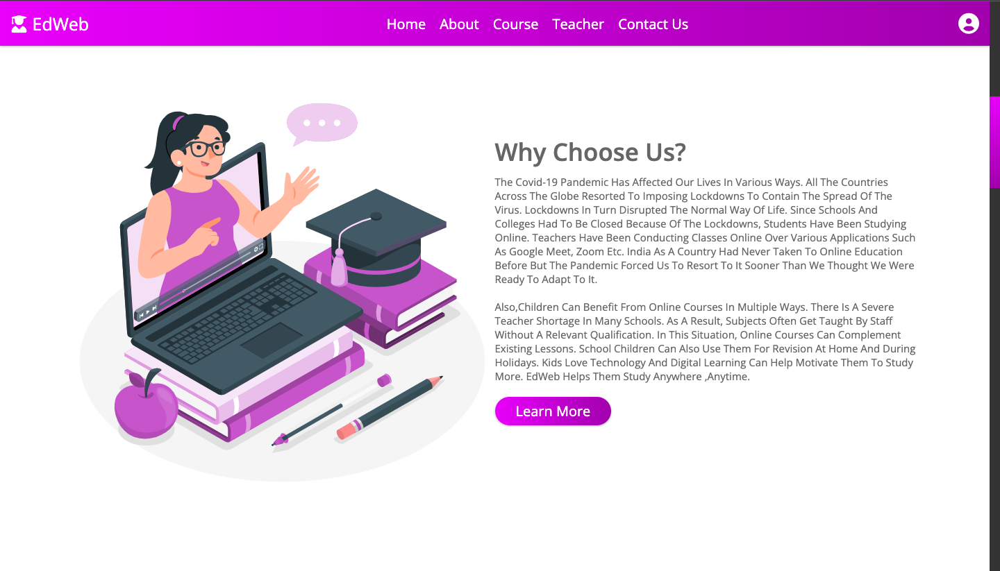
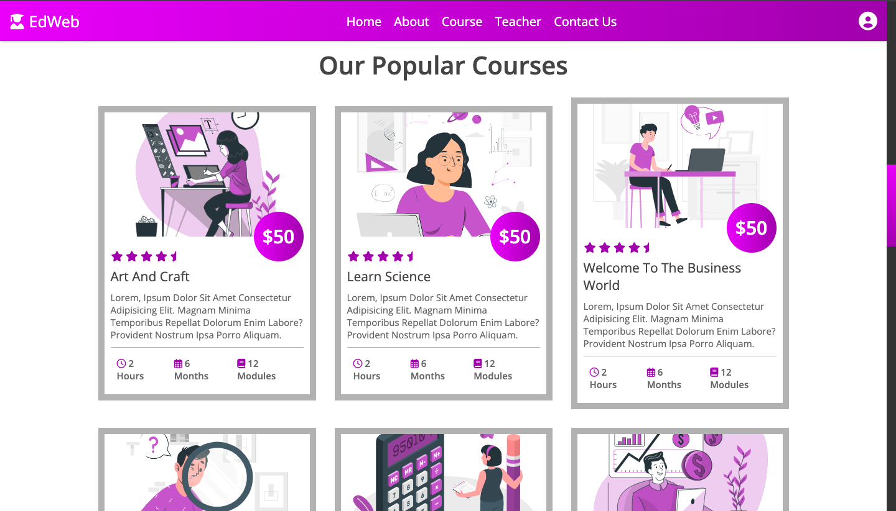
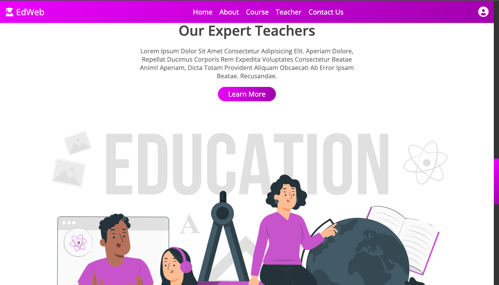
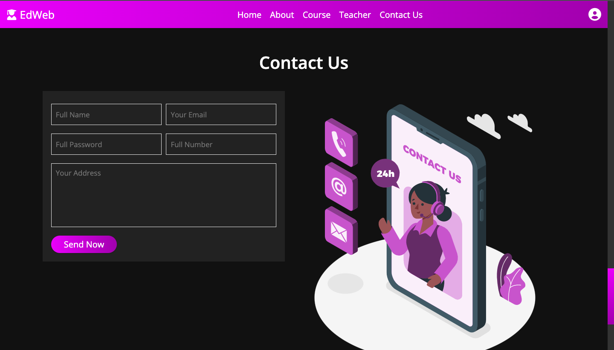

  
# EdWeb
  
  ### Online Education Platform For Kids

  
  

## Introduction :shamrock:

The Covid-19 pandemic has affected our lives in various ways. All the countries across the globe resorted to imposing lockdowns to contain the spread of the virus. Lockdowns in turn disrupted the normal way of life. Since schools and colleges had to be closed because of the lockdowns, students have been studying online.India as a country had never taken to online education before but the pandemic forced us to resort to it sooner than we thought we were ready to adapt to it.

EdWeb is an online education website which offers interactive and fun courses for kids.EdWeb is a responsive website built using HTML,CSS and JavaScript. It has various features like LogIn Page , About Section, Courses Section and much more.

## Features :eyes:

### Home Page

### LogIn/SignUp Page

### About Us

### Course Section

### Teachers Section

### Contact Us 
 

## Tech Stacks

+ HTML
+ CSS
+ JavaScript

## Developer :woman_technologist:
<table>
<td>

Mahima Khatri

</td>
</tr>
</table>

*Work In Progress*

